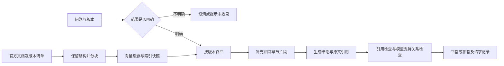

# Knowledge RAG Lab：版本感知的开发者技术支持助手

面向 AI 应用开发实习的可复现工程项目。当前以 FastAPI 官方中文文档为知识域，围绕接口使用、跨域、文件上传、依赖清理、代理和部署问题提供带证据的技术支持。

先阅读 [PROJECT_CONTEXT.md](PROJECT_CONTEXT.md) 和 [AGENTS.md](AGENTS.md)。场景选择及验收范围见 [实施计划](docs/IMPLEMENTATION_PLAN.md)，数据边界见 [数据卡](evaluation/SUPPORT_DATA_CARD.md)。

## 当前能做什么

- 固定官方文档提交号、文件哈希和许可证，展开同版本的代码示例引用。
- 支持 Markdown/TXT/PDF；保留代码缩进、标题、章节及 PDF 物理页码。
- 支持字符窗口和章节分块，提供 BM25、Dense、RRF Hybrid；产品与版本过滤在召回前应用。
- 有多个文档版本但未指定时先澄清；未收录版本明确拒答。
- 补充同一文档、同一章节的相邻片段，最多 16000 字符上下文。
- 真实模型按结论输出引用和原文，校验引用编号及原文匹配，再由模型检查支持关系。模型核验仍需人工抽查。
- 同一来源在同一版本内更新时替换旧内容；SQLite 缓存未变化的文本向量；新索引失败时旧内容保持可用。
- 页面展示回答状态、实际引用、原文、召回记录、索引指纹与阶段耗时。
- 评测区分文档命中、具体证据覆盖和回答行为，保存原始 JSON、Markdown 及数据/代码指纹。

核心链路保持显式 Python 实现，便于定位分块、召回、证据不足和生成错误。



## 立即运行零密钥演示

Windows / PowerShell，Python 3.11+。新机器必须重建虚拟环境：

```powershell
python -m venv .venv
.\.venv\Scripts\python.exe -m pip install -e ".[dev]"
.\.venv\Scripts\python.exe -m scripts.ingest_support --demo
.\.venv\Scripts\python.exe -m scripts.serve --demo
```

打开 [本地演示](http://127.0.0.1:8000)。`--demo` 明确使用 BM25 + 抽取式展示，Hashing 只用于本地索引与对照实验，不调用模型 API。先不选版本提交一次问题，验证澄清；再选 0.115.0，查看该版本的证据。页面不会把抽取片段标成真实模型答案。

仓库已包含可校验的文档快照。需要重新下载时运行：

```powershell
.\.venv\Scripts\python.exe -m scripts.fetch_support_corpus
```

17 个主题各含两个历史版本，共 34 个文件；这不是最新文档，也不是 34 个独立业务来源。原有培养管理 PDF 保留在 `evaluation/corpus/`。

## 百炼兼容 API 模式

在未提交的 `.env` 中填写控制台给出的密钥、地域对应的兼容 Base URL 和有权使用的模型名。当前准备的模型名为 `text-embedding-v4` / `qwen-plus`，实际可用性必须由检查命令确认。

```text
DASHSCOPE_API_KEY=在本地填写
DASHSCOPE_BASE_URL=控制台显示的兼容接口地址
EMBEDDING_PROVIDER=openai_compatible
EMBEDDING_MODEL=text-embedding-v4
LLM_PROVIDER=openai_compatible
LLM_MODEL=qwen-plus
LLM_ENABLE_THINKING=false
CHUNKING_STRATEGY=sections
RETRIEVAL_STRATEGY=hybrid
```

依次运行：

```powershell
.\.venv\Scripts\python.exe -m scripts.check_models
.\.venv\Scripts\python.exe -m scripts.ingest_support
.\.venv\Scripts\python.exe -m scripts.serve
```

检查只进行少量模型请求，记录连接及输出格式，不代表效果评测。正式回答包含生成和支持关系检查两次调用。失败只报告异常类型，不打印密钥或原始认证错误。

也支持分别配置 `EMBEDDING_API_KEY/BASE_URL` 和 `LLM_API_KEY/BASE_URL`；Ollama 模式模板见 `.env.ollama.example`，检查脚本为 `scripts.check_ollama`。本轮没有验证 Ollama。

## 评测与复现

原有三份示例文档、六个问题只用于冒烟测试：

```powershell
.\.venv\Scripts\python.exe -m pytest
.\.venv\Scripts\python.exe -m ruff check app scripts tests
.\.venv\Scripts\python.exe -m scripts.evaluate --demo --report-name latest
```

新场景有 **55 个待人工复核候选问题**，划分为 47 题开发集、8 题测试集。同组问题不跨划分。本轮只使用开发集，不声称已建成正式 benchmark。

```powershell
.\.venv\Scripts\python.exe -m scripts.evaluate --demo `
  --documents evaluation/support_corpus `
  --questions evaluation/questions.support.candidate.jsonl `
  --split development --chunking-strategy sections `
  --top-k 1 3 5 --answers --report-name support-development-hashing

.\.venv\Scripts\python.exe -m scripts.run_support_experiments --demo
```

矩阵比较 300/500/800 字符、window/sections 两种分块策略，以及 K=1/3/5/10。全部结果由脚本生成；记录具体问题、召回范围、配置与指纹。窗口变大、追加相邻片段都会改变证据预算，不能把它们的覆盖率差异直接当作等预算收益。

人工复核入口是 [SUPPORT_REVIEW.md](evaluation/SUPPORT_REVIEW.md)。确认并修订后另存 `evaluation/questions.support.reviewed.jsonl`，填写 `review_status=human_verified`、`reviewed_by`、`reviewed_at`。真实模型开发基线可运行：

```powershell
.\.venv\Scripts\python.exe -m scripts.evaluate `
  --documents evaluation/support_corpus `
  --questions evaluation/questions.support.reviewed.jsonl `
  --split development --require-reviewed --chunking-strategy sections `
  --top-k 1 3 5 --answers --report-name support-real-development
```

冻结配置之后再运行 `--split test`。文档级命中不代表证据命中；回答率不代表正确率；原文匹配和模型判定也不等于人工确认。缺失的答案正确率显示 null，未人工复核的数据和 Hashing 结果不可作为简历效果数字。

本轮 Python 3.12 / Windows 的依赖快照保存在 `requirements-dev.lock`；如需复现依赖，先安装该文件，再执行 `pip install -e . --no-deps`。它是版本快照，不包含包哈希，也不是跨平台部署保证。

## API

接口文档位于 `/docs`。主要接口为：

| 方法与路径 | 用途 |
|---|---|
| GET `/api/v1/catalog` | 产品与已收录版本 |
| POST `/api/v1/documents/text` | 文本及可选 product/version 导入 |
| POST `/api/v1/documents/upload` | 文件上传及表单 product/version |
| GET / DELETE `/api/v1/documents`、`/api/v1/documents/{id}` | 列表与删除 |
| POST `/api/v1/retrieval/search` | 按产品和版本召回 |
| POST `/api/v1/chat` | 回答、引用与请求记录 |

```json
{
  "question": "前端携带 Cookie 跨域时，allow_origins 可以设为星号吗？",
  "product": "fastapi",
  "version": "0.115.0",
  "top_k": 5
}
```

问答返回 `status`、`answer`、实际使用的 `citations`、初始 `retrieval`、补充后的 `context` 和 `trace`。状态包括 `answered`、`evidence_only`、`needs_clarification`、`insufficient_evidence`、`error`。引用编号对应上下文顺序，可能不连续。

## 运行边界与下一步

当前是绑定 127.0.0.1 的单进程演示服务，没有鉴权或多租户隔离。服务内部对写操作串行化，读请求使用不可变索引快照；不支持多个服务进程或导入脚本同时写同一索引。使用 CLI 导入后需要重启已启动的服务。JSON 存储适合小规模展示，BM25 仍全量重建，Dense 仍线性扫描。

向量缓存按供应商、模型、接口及 `EMBEDDING_CACHE_REVISION` 隔离；同名模型升级时应提高该修订值并重建索引。缓存中可以保留已经删除文档的向量，但删除后其分块不再参与检索。

下一步优先完成密钥配置、人工复核和真实模型基线，然后根据失败案例决定是否增加重排。扫描 PDF 的 OCR、完整代码块解析、鉴权、多进程一致性、向量数据库与部署压测尚未完成，不在简历中描述为已验证。
